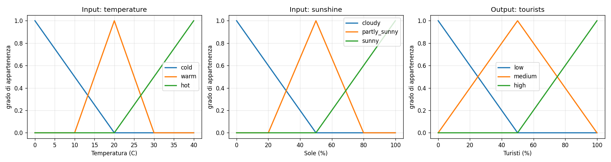
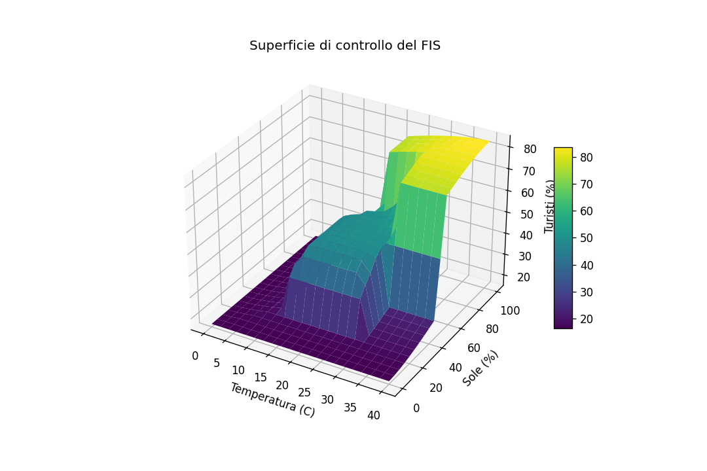

# 01 — Mamdani Fuzzy Inference System

Sistema di inferenza fuzzy di tipo **Mamdani** implementato in due modi paralleli: 
- una versione **from-scratch** in NumPy (per mostrare la meccanica);
- una con **scikit-fuzzy** (la libreria di riferimento). 
Un test automatico verifica che le due coincidano.

L'esempio applicativo è il **sistema di predizione dei turisti** visto a lezione: date temperatura e ore di sole, il sistema stima la percentuale di turisti attesi in un resort.

## Teoria di riferimento

Un FIS Mamdani trasforma input numerici in un output numerico attraverso regole linguistiche del tipo *SE … ALLORA …*. 
La pipeline (strategia **FITA**, *First Infer Then Aggregate*) è:

1. **Fuzzification** — il valore crisp `x₀` viene mappato nei gradi di appartenenza ai fuzzy set antecedenti tramite le membership function. Si usa il fuzzifier *singleton*.

2. **Firing strength** — per ogni regola, i gradi degli antecedenti sono combinati con una **t-norm** (per l'AND, tipicamente il minimo) o una **t-conorm** (per l'OR, tipicamente il massimo):

   ```
   αᵣ = min(μ_A(x₀), μ_B(y₀))     [se AND]
   ```

3. **Implicazione** — la firing strength `αᵣ` "taglia" il fuzzy set conseguente (implicazione di Mamdani = minimo):

   ```
   μ_clipped(z) = min(αᵣ, μ_C(z))
   ```

4. **Aggregazione** — i conseguenti tagliati di tutte le regole sono combinati con una t-conorm (massimo):

   ```
   μ_agg(z) = max_r μ_clipped_r(z)
   ```

5. **Defuzzification** — il fuzzy set aggregato è ridotto a un numero. Il metodo di riferimento è il **centroide (Center of Area)**:

   ```
   z* = Σ z·μ_agg(z) / Σ μ_agg(z)
   ```

### Le regole del sistema turisti

| # | Antecedente | Conseguente |
|---|-------------|-------------|
| R1 | temp `hot` **AND** sole `sunny` | turisti `high` |
| R2 | temp `warm` **AND** sole `partly_sunny` | turisti `medium` |
| R3 | temp `cold` **OR** sole `cloudy` | turisti `low` |

## Struttura del codice

```
src/
├── membership.py                  # MF triangolari, trapezoidali, gaussiane (da zero)
├── operators.py                   # t-norm, t-conorm, defuzzifier (da zero)
├── mamdani.py                     # motore di inferenza Mamdani (da zero)
├── example_tourists.py            # sistema turisti — versione from-scratch
├── example_tourists_skfuzzy.py    # sistema turisti — versione scikit-fuzzy
└── visualize.py                   # genera i grafici in figures/
tests/
└── test_consistency.py           # verifica scratch == skfuzzy + proprietà MF
```

## Esecuzione

```bash
pip install -r requirements.txt

python src/example_tourists.py          # inferenza from-scratch
python src/example_tourists_skfuzzy.py  # inferenza con libreria
python src/visualize.py                 # genera le figure
python interactive.py                 	# modalita' interattiva (chiede i valori) e restituisce l'output
pytest tests/                           # test automatici
```

Output atteso (i due metodi coincidono entro la tolleranza di discretizzazione):

```
temp= 19C  sun= 60%  ->  turisti stimati =  49.9%
temp= 35C  sun= 90%  ->  turisti stimati =  82.8%
temp=  5C  sun= 20%  ->  turisti stimati =  17.2%
```

## Figure

| Membership functions | Superficie di controllo |
|----------------------|-------------------------|
|  |  |

La superficie di controllo mostra come l'output vari con continuità al variare dei due input — la caratteristica che distingue un sistema fuzzy da uno a soglie nette.

## Possibili estensioni

Il progetto è pensato per crescere. In ordine di difficoltà:

- **Defuzzifier alternativi** — confrontare centroide, MOM e bisector sullo stesso sistema e discutere quando divergono (già predisposto: `MamdaniFIS(defuzz="mom")`).
- **Membership function diverse** — sostituire le triangolari con gaussiane e osservare l'effetto sulla superficie di controllo.
- **Più regole / più input** — aggiungere una terza variabile (es. umidità) e gestire la crescita del numero di regole.
- **Interfaccia interattiva** — una piccola dashboard (Streamlit) con slider per gli input e visualizzazione in tempo reale dell'aggregato.
- **Confronto con TSK** — implementare la stessa logica in versione Takagi-Sugeno e confrontare accuratezza e interpretabilità (ponte verso il progetto ANFIS).
- **Ponte verso il progetto 04** — esporre i parametri delle MF in modo che un algoritmo genetico possa ottimizzarli.

## Note implementative

L'implementazione from-scratch privilegia la **chiarezza** sulla performance: l'inferenza è esplicita e commentata passo per passo. 
Per sistemi con molte regole o valutazioni ripetute, la versione `scikit-fuzzy` è preferibile.
